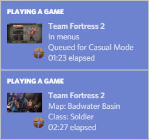

# TF2 Rich Presence
Discord Rich Presence for Team Fortress 2
- Current game state, queue info, playtime, and more
- Configurable, reliable, and performance-efficient

(The actual program is nowhere near as nice looking as this)

## Download
With 7-Zip's built-in extractor: [tf2_rich_presence_v1.13.1_self_extracting.exe](https://github.com/Kataiser/tf2-rich-presence/releases/download/v1.13.1/tf2_rich_presence_v1.13.1_self_extracting.exe) (8.1 MB)  
Extract it yourself: [tf2_rich_presence_v1.13.1.zip](https://github.com/Kataiser/tf2-rich-presence/releases/download/v1.13.1/tf2_rich_presence_v1.13.1.zip) (11.1 MB)

## Installation and running
1. Extract `tf2_rich_presence_v1.13.1.zip` OR run `tf2_rich_presence_v1.13.1_self_extracting.exe`, whichever you downloaded.
2. Run `Launch TF2 with Rich Presence.exe`.
	- OR run `Launch Rich Presence alongside TF2.exe`. This one doesn't automatically start Team Fortress 2.
	- Both require Discord and Steam to be running as well and will wait until the game and both programs are running. 

Note than having Python installed is not required. For faster launching, you can add the first EXE to your taskbar/start menu/desktop/etc or to Steam as a non-Steam game.

## Changelogs
- [Changelogs.html](https://htmlpreview.github.io/?https://github.com/Kataiser/tf2-rich-presence/blob/master/Changelogs.html)
- [Releases](https://github.com/Kataiser/tf2-rich-presence/releases)

## Linux and MacOS support?
At the moment, both are considered unsupported. They probably work since [Jan200101](https://github.com/Jan200101) did some work on Linux a while ago, but the release builds are very much formatted for Windows. Contributors are welcome! Also check out [EmeraldSnorlax/TF2-RPC](https://github.com/EmeraldSnorlax/TF2-RPC), which is a much less mature program but is built on Linux and theoretically cross-platform too.

## Building from source
For making and testing changes, or simply always running the most up-to-date code.
1. Either clone the repo or [download the source](https://github.com/Kataiser/tf2-rich-presence/archive/master.zip).
2. Copy the entire source to another location (sorry) and put the files outside of `TF2 Rich Presence` into that folder.
3. Extract `TF2 Rich Presence\python-3.7.5-embed-win32.zip`.
4. Make sure the `python` and `pip` commands point to Python 3.7.x
5. Install a C compiler (see [Installing Cython](http://docs.cython.org/en/latest/src/quickstart/install.html)). I personally use VS 2019.
6. From within `TF2 Rich Presence`, run `pip install -r requirements.txt` and `python build.py`.
